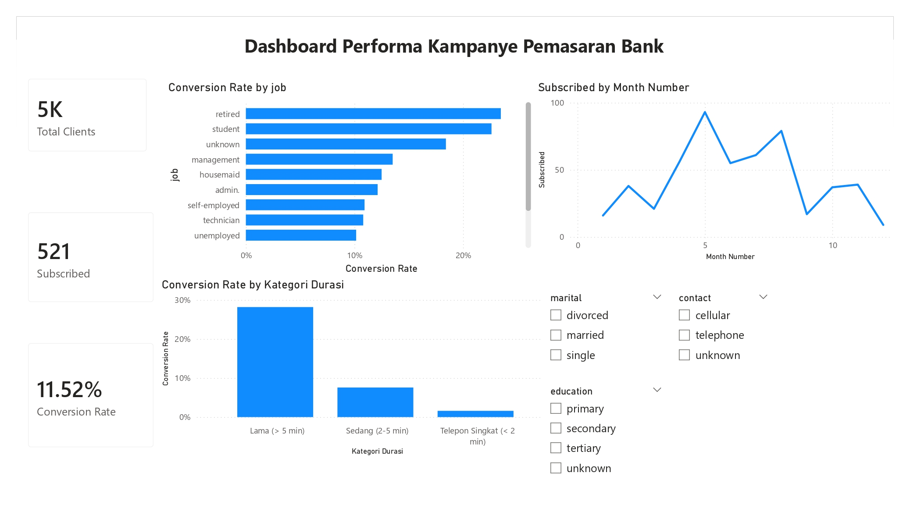
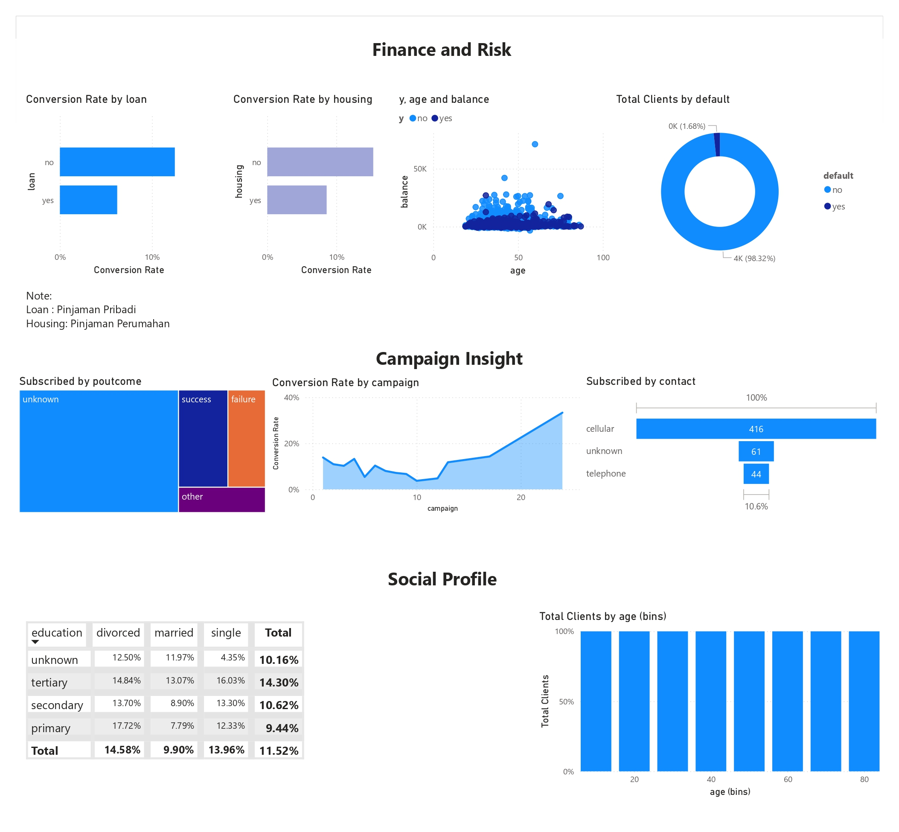

# 📊 Bank Marketing Strategy Prediction using Random Forest

## 📝 Deskripsi Proyek
Proyek ini bertujuan untuk membangun model **Machine Learning** yang dapat memprediksi probabilitas nasabah bank untuk berlangganan deposito berjangka (`y`). Dengan menggabungkan **Analisis Visual (Power BI)** dan **Analisis Prediktif (Python)**, bank dapat mengoptimalkan kampanye pemasaran mereka dengan menargetkan nasabah yang paling potensial, sehingga meningkatkan efisiensi operasional dan *conversion rate*.

---

## 📈 Analisis Visual (Power BI)
Analisis deskriptif dilakukan untuk memahami profil nasabah. Anda dapat melihat dashboard interaktif melalui file `.pbix` di folder dashboard.

**Preview Dashboard:**

> 📂 **File Power BI:** [Download Bank Marketing.pbix](dashboard/Bank%20Marketing.pbix)

---

## 🛠️ Metodologi & Alur Kerja
Notebook ini menerapkan standar *Data Science Workflow* untuk menghasilkan prediksi yang akurat:

1.  **Data Ingestion**: Memuat dataset `bank_y_cleaned.csv`.
2.  **Data Preprocessing**:
    *   **Encoding**: Transformasi variabel kategorikal menggunakan *One-Hot Encoding*.
    *   **Handling Imbalance**: Menerapkan teknik **SMOTE** (Synthetic Minority Over-sampling Technique) karena data target sangat tidak seimbang (imbalanced).
    *   **Feature Scaling**: Menggunakan **StandardScaler** untuk menyamakan skala fitur numerik agar performa model lebih stabil.
3.  **Predictive Modeling**: Implementasi algoritma **Random Forest Classifier**.
4.  **Model Evaluation**: Penilaian menggunakan *Confusion Matrix* dan *Classification Report*.

---

## 🚀 Hasil Evaluasi Model
Berdasarkan pengujian pada data uji (*test set*), model Random Forest menghasilkan performa sebagai berikut:

### 1. Performa Statistik
*   **Overall Accuracy**: **89%**
*   **Macro Average F1-Score**: **0.72**
*   **Weighted Average F1-Score**: **0.89**

### 2. Analisis Classification Report
| Class | Precision | Recall | F1-Score |
|-------|-----------|--------|----------|
| **0 (Tidak Berlangganan)** | 0.93 | 0.95 | 0.94 |
| **1 (Berlangganan)** | 0.55 | 0.46 | 0.50 |

**Interpretasi:**
*   Model memiliki **Akurasi 89%**, namun tantangan terdapat pada *Recall* kelas 1 (Yes). Hal ini dikarenakan jumlah sampel nasabah yang berlangganan jauh lebih sedikit dibandingkan yang tidak.
*   Meskipun demikian, model sangat kuat dalam menyaring nasabah yang **tidak potensial** (F1-Score 0.94), yang sangat berguna untuk menghemat biaya operasional marketing.

---
## 🧪 Hasil Analisis Python (EDA & Modeling)

Berikut adalah beberapa temuan kunci dari analisis data mining:

### 1. Distribusi Target & Fitur

### 2. Performa Model

### 3. Fitur Paling Berpengaruh

---

## 💡 Insight Bisnis & Rekomendasi
1.  **Efisiensi Biaya**: Bank dapat menghemat biaya kampanye dengan menyaring nasabah yang diprediksi "No", karena model memiliki akurasi 93% dalam mengenali kelompok ini.
2.  **Kualitas Komunikasi**: Variabel **durasi telepon** adalah faktor kunci. Bank disarankan untuk meningkatkan kualitas interaksi telepon untuk meningkatkan peluang konversi.

---

## ⚙️ Library yang Digunakan
Pastikan library berikut terpasang di komputer Anda:
*   `pandas`, `numpy`, `matplotlib`, `seaborn`, `scikit-learn`, `imbalanced-learn`

## 📂 Cara Menjalankan
1.  Unduh file `bank_classification.ipynb` dan dataset `bank_y_cleaned.csv`.
2.  Buka di **Google Colab** atau **Jupyter Notebook**.
3.  Pastikan dataset telah diunggah ke direktori kerja Anda.
4.  Jalankan semua cell.

---
© 2025 [Annisa Tristanti]
